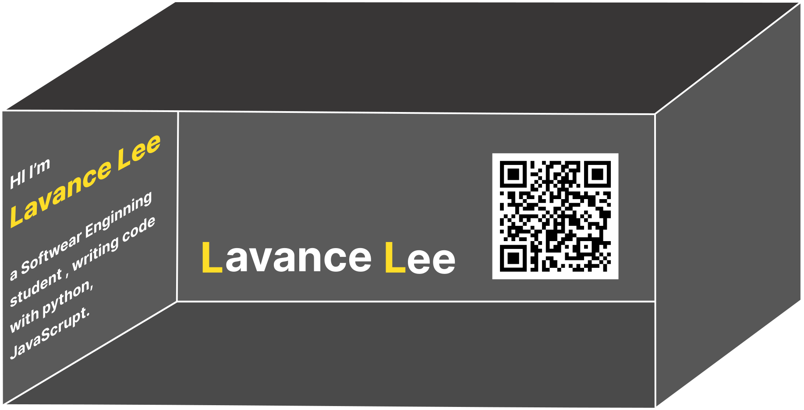

# QR-3DResume-three.js

This project combines `Three.js`, also [`jsQR`](https://github.com/cozmo/jsQR) created an interactive 3D resume demo.

User can scan spectific QR card and redirect to this website, which then triggers the display of a 3D model, also my social media links.

The 3D model can be rotated, zoomed using Three.js.

## Details
+ QR Recognition: https://github.com/cozmo/jsQR

+ 3D model assets: https://sketchfab.com/feed

+ Three.js tutorial: https://threejs.org/manual/#zh/fundamentals 

## Presentation

Now you can use Figma or Illustrator to design a fun Resume QR Card!

When the user scans the QR code, will be redirected to the deployed website - showing the 3D effects and media links setted.

## Processing
- [X] the whole deploy process of this project from idea to reality!

- [X] Basic uses of three.js to load and show a gITF file successfully!

- [ ] More complete and rich 3D interaction

- [ ] Improve the current overly simple social media button interaction

## Demo

NOTE: loading the whole file takes time. It's normal that you can't see anything in a few seconds, just wait IF you want see this stupid project:)

